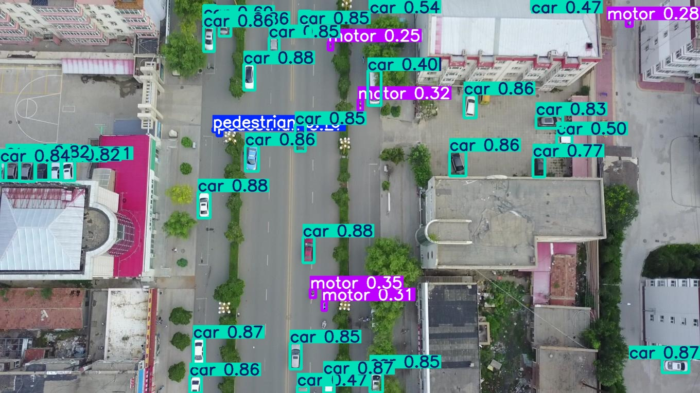
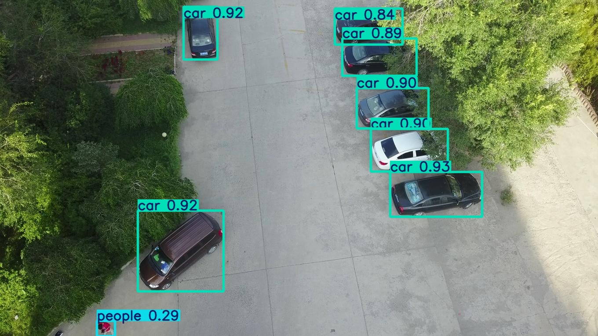
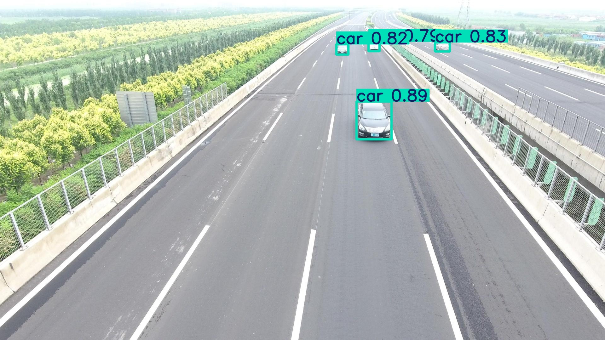

# 🛰️ Surveillance Object Detection — YOLOv8l + SAHI

> Aerial surveillance object detection on VisDrone 2019 dataset using YOLOv8l with multi-GPU training and SAHI sliced inference.

[](https://python.org)
[](https://github.com/ultralytics/ultralytics)
[](https://github.com/obss/sahi)
[](https://github.com/VisDrone/VisDrone-Dataset)
[](https://github.com/Lakshminarayan566/surveillance_object_detection_yolov8)

---

## 🔥 Overview

A high-performance aerial surveillance object detection pipeline designed for dense urban and occlusion-heavy scenes. Trained on VisDrone 2019 using multi-GPU acceleration and enhanced with SAHI sliced inference for superior small-object detection.

| Metric | Score |
|---|---|
| mAP@0.5 | **~50%** |
| mAP@0.5:0.95 | **30.3%** |
| Image Resolution | 896 × 896 |
| Object Classes | 10 |
| Training GPUs | 2× Tesla T4 |

---

## 📊 mAP Progression

| Version | mAP@0.5 |
|---|---|
| Baseline (YOLOv8m) | 40.5% |
| Upgraded (YOLOv8l, 896px) | **~50%** |
| YOLOv8l + SAHI (inference) | **~52–55%** *(expected)* |

---

## 🧠 Dataset — VisDrone 2019

Aerial imagery dataset focused on dense small-object detection.

**10 Object Classes:**

`pedestrian` · `people` · `bicycle` · `car` · `van` · `truck` · `tricycle` · `awning-tricycle` · `bus` · `motor`

---

## ⚙️ Model Configuration

| Parameter | Value |
|---|---|
| Model | YOLOv8l |
| Epochs | 70 |
| Image Size | 896 × 896 |
| Optimizer | AdamW |
| GPUs | 2× Tesla T4 |
| Augmentation | Mosaic, MixUp, CopyPaste |
| SAHI Slice Size | 512 × 512 |
| SAHI Overlap | 0.2 |

---

## 📁 Project Structure

```
surveillance_object_detection_yolov8/
│
├── train.py                  # Model training
├── detect.py                 # Standard inference
├── evaluate.py               # mAP evaluation
├── sahi_inference.py         # SAHI sliced inference
├── quantize.py               # ONNX/INT8 export for edge deployment
│
├── configs/
│   ├── kaggle_config.yaml    # Kaggle training config
│   └── colab_config.yaml     # Colab training config
│
├── results/
│   └── sample_predictions/   # Sample output images
│       ├── highway_vehicle_detection.jpg
│       ├── parking_detection.jpg
│       └── urban_traffic_detection.jpg
│
├── requirements.txt
├── .gitignore
└── README.md
```

---

## 🚀 Installation

```bash
git clone https://github.com/Lakshminarayan566/surveillance_object_detection_yolov8.git
cd surveillance_object_detection_yolov8
pip install -r requirements.txt
```

---

## 🏋️ Training

```bash
python train.py
```

---

## 🔍 Standard Inference

```bash
python detect.py --weights weights/best.pt --source images/
```

---

## 🛰️ SAHI Sliced Inference

> Better small-object detection via sliced tiles

```bash
python sahi_inference.py
```

---

## 📏 Evaluation

```bash
python evaluate.py
```

---

## 📦 Quantization (Edge Deployment)

```bash
python quantize.py
```

Exports to ONNX/INT8 format — optimized for **Jetson Nano** and edge devices.

---

## 🖼️ Sample Predictions
## Sample Predictions

Below are example detection results from the trained YOLOv8 model on the VisDrone aerial surveillance dataset.

| Urban Traffic | Parking Area | Highway |
|---------------|-------------|---------|
|  |  |  |

## 🔬 How SAHI Works

```
Large Aerial Image (896×896)
        │
        ▼
  Slice into 512×512 tiles
        │
        ▼
  YOLOv8l detects on each tile
        │
        ▼
  Merge all detections (NMM)
        │
        ▼
  Final result with small objects detected ✅
```

---

## 📦 Deployment

- ✅ ONNX export compatible
- ✅ Optimizable for **Jetson Nano**
- ✅ Edge deployment ready
- ✅ Multi-GPU training supported

---

## 📓 Kaggle Notebook

[▶ View Full Training Notebook](https://www.kaggle.com/your-notebook-link)

---

## 👨‍💻 Author

**Lakshminarayan** — AIML Student · Computer Vision Engineer · Multi-GPU Training

